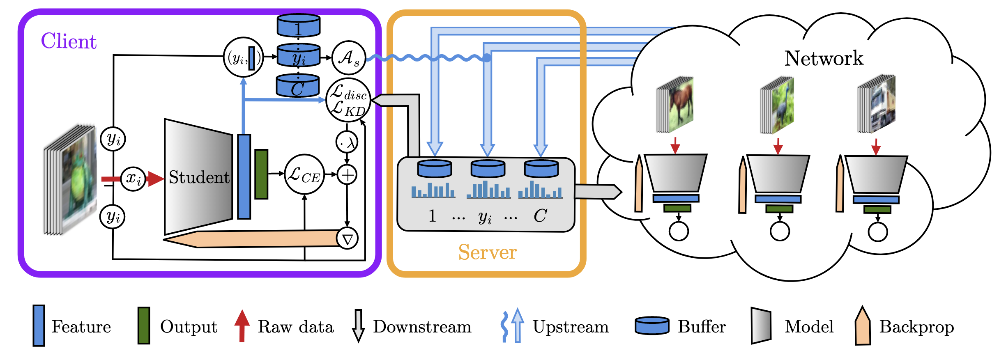
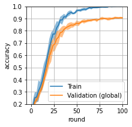
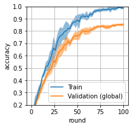

# Scalable Collaborative Learning via Representation Sharing

This repository contains all the code needed to reproduce the results presented in our paper. 



## Folder structure
This repository is organised as follows:
- `run.py`: Executable containg the code for the main algorithm (see function documentation).
- `helpers.py`: Module containing all the helpers function for loading/training/evaluation/etc.
- `models.py`: Module containing all the CNN models that are used.
- `Figures.ipynb`: Jupyter notebook containing all the results presented in the paper (figures + quantitative results).
- `Exploration.ipynb`: Jupyter notebook containing some additional results presented in the thesis + some exploratory code (figures)
- `LICENSE`: MIT Licence.
- `MasterThesis.pdf`: Thesis report.
- `requirements.txt`: Text file containing the required libraries to run the code.
- `saves`: Folder where experiments results are saved (by default)
- `data`: Folder where the data is downloaded/loaded
- `figures`: Folder containing all the figures presented in the paper.

## Requirements

To install requirements, install [Minconda](https://docs.conda.io/en/latest/miniconda.html), then create and activate a new conda environment with the commands:

```setup
conda create --name <env_name> --file requirements.txt
conda activate <env_name>
```


## Execution

To run an experiment, execute the following command (only an example, type `python run.py -h` for a detailed explanation of all the arguments):
```train
python run.py --n_clients 2 --dataset CELEBA  --model LeNet5 --feature_dim 84 --rounds 100
```

## Results

All the results presented in the paper are displayed in the output of the cells in `Figures.ipynb`. Below are the training histories of the models when 1200 training samples of the MNIST dataset are split uniformly at random between 5 users (LeNet5 model). From left to right: our framework, [federated knowledge distillation](https://arxiv.org/abs/1811.11479), [federated learning](https://arxiv.org/abs/1602.05629) and independent learning.

 
